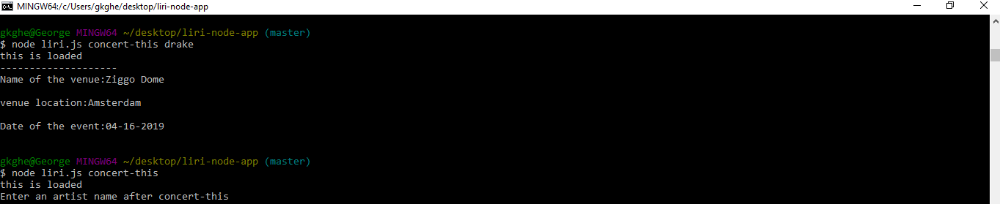
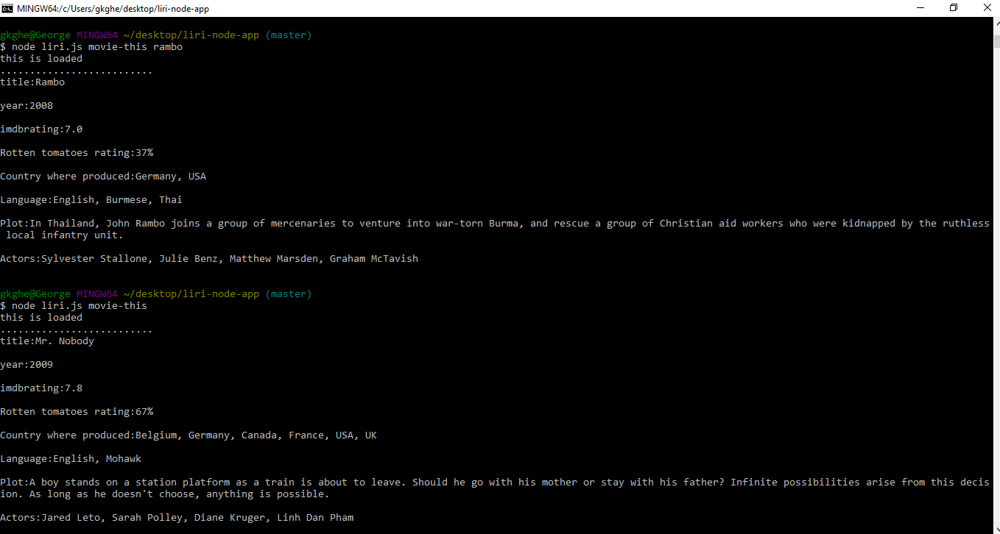
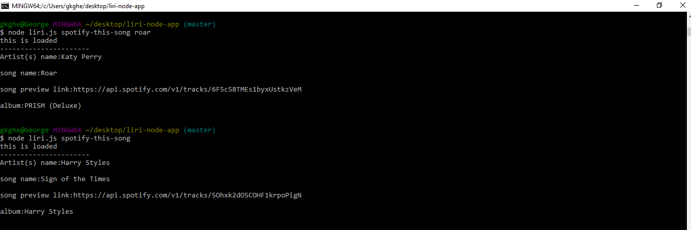
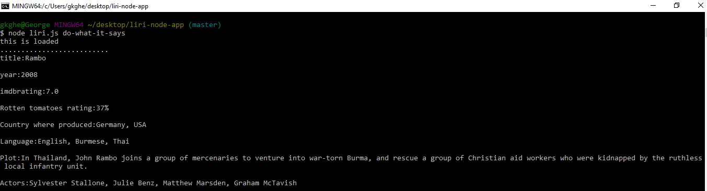
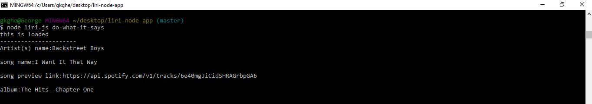
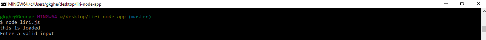

# liri-node-app
 * it is an app that work with 3 api's.The three api's are **OMDB,bank in town,spotify**.
 *It works on the command line.
 *The packages that i installed on this app **axios,moment,spotify,fs,doeenv**
 *The main functions of the app is *spotify-this-song,movie-this,concert-this,do-what-it-says*
 ##liriapp
 *It's main function on this app,Within this function i added a *switch staement from this switch statement the user can select the 4 functions*
 ###movie-this
 *It works with the **omdb api** the user can send a request to the api and it will return the json object for that request.Here the *movie name is the user input to the api*
 ####concert-this
 *In this function it makes a request to the **bank in town api** with an artis name and it will return a json object corresponding to that request.
 #####spotify-this-song
 *Within this function it sends a request to the **spotify api** and returns a json object for that request.
 ######do-what-it-says
*There is a txt file on this app named with **random.txt**,within that file i stored the two user inputs.So if the user select **do-what-it-says** it will choose any of the above functionalities corresponding to the data in the **random.txt**.Now i stored **spotify-this-song,"I Want it That Way"**.so it will select the **spotify-this-song** function and return the result.
*If the user didn't choose any the above functions it will tell you to enter some valid input.
#######screenshot
**image contains two outputs,one with an artist name and response and other one is without artist  name so it will tell you to enter an artist name**
 
 **movie response with user value and default value.**
 
 **spotify api response with user value and default value.**
 
 **random.txt with values "movie-this and default value.**
 
 **random.txt with values spotify-song-this and default value.**
 
 **image for user invalid input**
 

